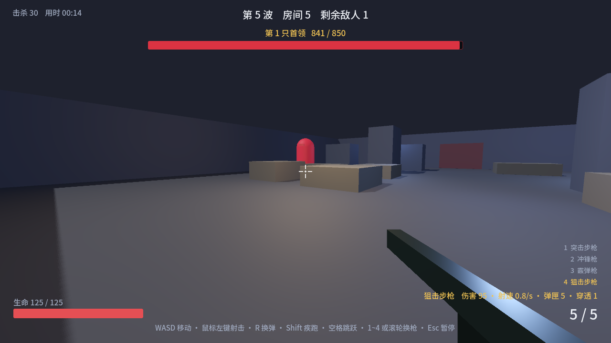
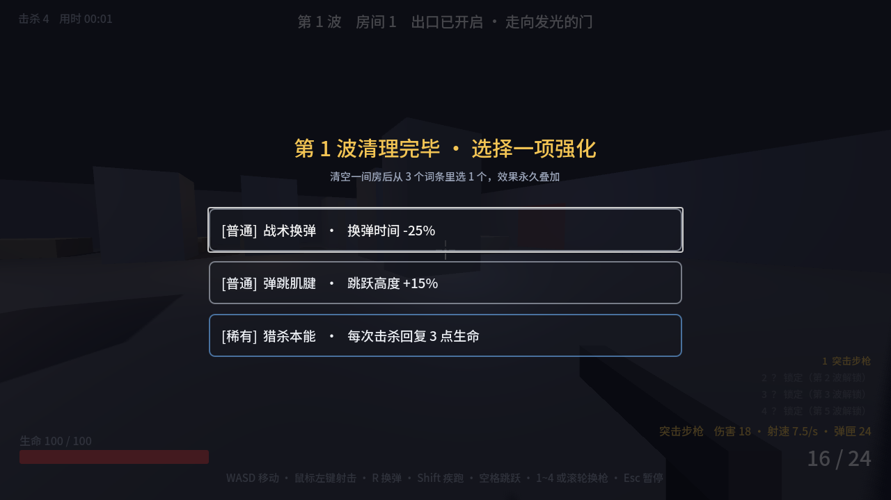

# Rogue FPS Prototype · 肉鸽 FPS 最小原型

一个用 **Godot 4** 从零实现、**不依赖任何美术/音频素材**（几何体建模 + 代码生成关卡与 UI + 程序化合成音效）
的第一人称射击 roguelike 原型。目的很单纯：让你在一两天内理解"一个 FPS + 一个肉鸽循环"到底由哪些零件组成，
然后自己往里加东西。




**想直接玩？** 见 [二、在线试玩](#二在线试玩github-pages)。

---

## 一、玩法

一局的流程是一条闭环，而且这一版已经换成了**房间流**（不再是单张竞技场）：

```
第 1 间房 → 刷怪 → 清空 → 门开（发绿光）→ 走进门 → 淡黑 → 下一间房（换一张随机布局）
   ↑                                                                          │
   └──────────── 每 5 波刷一只首领（血条挂在屏幕顶部）· 死亡后按 R 重开 ────────┘
```

- **房间流**：每清空一间房就从 3 个强化词条里选 1 个，然后开门进下一间。
  换房时会重建场地、重新烘焙导航网格、淡黑过渡 —— 就是《枪火重生》《Risk of Rain》那个节奏。
- **波次与难度爬坡**：第 N 波敌人数量 `2 + round(N × 1.7)`（上限 24），血量 +19%/波、伤害 +10%/波。
- **三种小怪**：`普通`（红，均衡）、`冲锋`（黄，血少跑得快）、`重装`（紫，血厚打得疼），第 3 / 5 波开始出现。
- **首领波**：每 5 波一只深红自发光的大怪。血量按"第几只"指数增长（`850 × 1.65^(tier-1)`，不是按波次线性），
  会朝玩家打**三连弹幕**，死亡时炸出 12 块碎片。它出现时顶部有名字 + 血条。
- **4 把枪**：`突击步枪`（起手）、`冲锋枪`（第 2 波解锁）、`霰弹枪`（第 3 波，8 弹丸）、`狙击步枪`（第 5 波）。
  数值全在 `scripts/weapons.gd` 一张表里，加枪只要加一个函数。
- **14 个强化词条**：可叠加，乘算 / 加算混合，靠 `scripts/upgrades.gd` 一张表驱动。
- **存档 / 排行榜**：死亡结算时把成绩写进本地 JSON，保留前 10 名，按 `波次 > 击杀 > 用时` 排序，
  结算面板上直接显示榜单和你的名次。

### 操作

**桌面（键鼠）**

| 按键 | 功能 |
| --- | --- |
| `W A S D` | 移动 |
| `鼠标` | 转视角 |
| `鼠标左键` | 射击（自动武器按住连发） |
| `R` | 换弹（死亡后按 R 重开） |
| `Shift` | 疾跑 |
| `空格` | 跳跃 |
| `1` `2` `3` `4` | 直接切到第 N 把枪 |
| `鼠标滚轮` / `Q` `E` | 循环换枪 |
| `Esc` | 暂停 / 释放鼠标 |

**手机（触屏）**

| 手势 | 功能 |
| --- | --- |
| 左半屏按下并拖动 | 虚拟摇杆移动（推到底 = 疾跑） |
| 右半屏拖动 | 转视角 |
| 右下角大圆 | 射击（按住连发） |
| 小圆按钮 | `跳跃` / `换弹` / `换枪` |

触屏控件**只在真的摸到屏幕时才出现**，插鼠标的电脑完全看不到它。
手机请横屏握持；竖屏时会盖一层"请把手机横过来"的提示。

---

## 二、在线试玩（GitHub Pages）

仓库里带了 `.github/workflows/deploy-pages.yml`：**推送到 `main` 就会自动导出 Web 版并发布到 GitHub Pages**，
不需要把 39MB 的 `index.wasm` 提交进仓库。

启用一次即可（只需手动做一次）：

1. 打开仓库 → `Settings` → 左侧 `Pages`；
2. `Build and deployment` → `Source` 选 **GitHub Actions**；
3. 回到 `Actions` 页，手动跑一次 `导出 Web 并发布到 GitHub Pages`（或随便推一次代码）；
4. 跑完后 `Settings → Pages` 顶部会给出网址，形如
   `https://<用户名>.github.io/<仓库名>/`。

> 第一次跑会下载 Godot 编辑器（72MB）和导出模板（1.2GB），大约 5~10 分钟；
> 之后按版本号命中缓存，后面每次只要 1~2 分钟。

**自己本地想看效果**，不用等 CI：

```bash
godot --headless --path . --export-release "Web" build/web/index.html
cd build/web && python -m http.server 8765 --bind 127.0.0.1
# 浏览器打开 http://127.0.0.1:8765/index.html
```

> **注意别直接双击 `index.html`。** Godot 的 Web 版要下载 wasm 和 pck，
> `file://` 协议下会被浏览器的同源策略挡掉，必须走一个 HTTP 服务（上面那条 `http.server` 就是干这个的）。

---

## 三、跑起来

1. 打开 Godot 4.x（本项目在 **4.7.1** 上验证通过，其他 4.x 小版本可能改写 `project.godot`）。
2. `导入` → 选中本目录下的 `project.godot` → 导入并编辑。
3. 按 `F5`（或右上角 ▶）即可运行。

> 首次打开时 Godot 会生成 `.godot/` 缓存目录，已经在 `.gitignore` 里，**不要提交**。

### 命令行验证（很值得用）

不想开编辑器时，可以用无头模式自检，用来确认"工程本身没坏"：

```bash
# ① 导入资源（同时能查出所有脚本解析错误）
godot --headless --path . --import

# ② 自动跑一整局
godot --headless --path . --fixed-fps 60 --script res://tools/smoke_test.gd

# ②的快速版：每 5 帧秒一只怪，几十秒就能走完 13 间房
godot --headless --path . --fixed-fps 60 --script res://tools/smoke_test.gd -- --fast
```

`tools/smoke_test.gd` 是个"假玩家"：它会自己瞄准、**按武器射速节流地开枪**、切枪、换弹、
秒怪、选强化、往门口走、验证导航路径、盯着首领的血条和弹幕，死了还会主动重开一局
（这条路径本身也要覆盖），最后打印一份报告：

```
[smoke] 走过房间数：最深到第 13 间（当前这一局在第 13 间）
[smoke] 共开火 237 次 · 击杀 136 · 最终波次 13 · 阵亡重开 0 次
[smoke] 导航路径全部有效
[smoke] 跑满 3600 帧，没有脚本错误。
```

只要它干净通过（**退出码 0**），游戏逻辑就是好的，剩下的问题只可能出在编辑器设置或分辨率上。
有 `✗` 开头的行就说明有项目没通过，并且**退出码会是 1**，CI 里能真的卡住。

它还会盯着"有没有在推进"：连续 600 帧房间/波次/击杀都不变就打印现场状态
（暂停与否、HUD 状态、`enemies_alive`、场上敌人里有几个是"已死但没回收"、门开没开），
避免出现"跑完了但其实什么都没测到"的静默假通过。

### 把画面录成 PNG 序列来肉眼验收

```bash
godot --path . --write-movie /abs/path/f.png --fixed-fps 60 --quit-after 300
# 会生成 f00000001.png ... 和 f.wav（音频也一起录下来了）
```

配合 `--script res://tools/smoke_test.gd -- --fast --frames=900` 就能录一段"有战斗"的片段
（默认要跑 3600 帧，`--frames=N` 可以截短）。

---

## 四、目录结构

```
.
├── project.godot               # 工程配置：主场景、窗口、输入映射、渲染、自定义字体
├── export_presets.cfg          # 导出配置：Web + Android 两个预设
├── icon.svg
├── scenes/
│   ├── main.tscn               # 主场景，只挂了一个脚本，其余全部代码生成
│   ├── player.tscn             # 玩家：碰撞体 + 颈部 + 摄像机 + 枪械模型 + 枪口火光
│   ├── enemy.tscn              # 敌人：碰撞体 + 胶囊 mesh + NavigationAgent3D
│   ├── projectile.tscn         # 首领弹幕
│   └── hud.tscn                # HUD 的 CanvasLayer 壳（process_mode = Always）
├── scripts/
│   ├── main.gd                 # ★ 关卡管理器：建房、刷怪、波次、房间流、导航网格、结算
│   ├── player.gd               # ★ 玩家：移动、视角、射线枪、换枪、触屏接管
│   ├── enemy.gd                # ★ 敌人：导航寻路、避障、接触伤害、首领弹幕
│   ├── hud.gd                  # ★ 全部界面（准星/血条/弹药/武器栏/首领条/强化/结算/排行榜）
│   ├── upgrades.gd             # ★ 肉鸽词条池（数据 + 生效逻辑）
│   ├── weapons.gd / weapon.gd  # ★ 武器库与 WeaponData 资源
│   ├── touch_ui.gd             # ★ 虚拟摇杆 + 触屏按钮
│   ├── sfx.gd                  # ★ 程序化音效（全部代码合成，零素材）
│   ├── save.gd                 # ★ 存档 / 排行榜（JSON）
│   └── projectile.gd           # 首领弹幕的飞行与命中
├── tools/
│   ├── smoke_test.gd           # 无头冒烟测试（CI 也用它把门）
│   ├── build_font.py           # 裁剪中文字体子集（生成 assets/fonts/game_font.ttf）
│   ├── browser_check.mjs       # 用 Chrome CDP 实测 Web 版能不能真跑起来（支持触屏模拟）
│   ├── fetch_web_templates.py  # 按需只下 .tpz 里的几个条目（用 HTTP Range，省掉 1.2GB）
│   └── probe_mirrors.py        # 给模板下载挑一条能走通的加速源
├── assets/fonts/               # 裁剪后的中文字体（266KB）+ 许可证
├── .github/workflows/          # 自动导出 Web 并部署 GitHub Pages
└── docs/                       # 截图
```

---

## 五、核心设计（改之前先看这段）

### 1. 碰撞层怎么分的

| 层 | 用途 | collision_layer | collision_mask |
| --- | --- | --- | --- |
| 1 | 地面 / 墙 / 柱子 | 1 | 0 |
| 2 | 玩家 | 2 | 1 |
| 3 | 敌人 | 4 | 1 |

玩家和敌人都**只和静态地形碰撞**，彼此不产生物理推挤 —— 这样敌人不会互相卡住，也不会把玩家顶飞。
伤害靠距离判定和射线（`player.gd` 里 `intersect_ray`，mask = `1 | 4`）实现。

### 2. 敌人寻路：NavigationAgent3D + 两层兜底

地形一复杂，原来那套"前向射线转向"就不够用了，所以换成了真正的导航：

- 每间房建房时，`main.gd` 用 `NavigationMesh` + `NavigationMeshSourceGeometryData3D`
  **手工搭一张网格多边形**（按 2.0m 格子铺，避开障碍），而不是运行时 `bake_navigation_mesh()` —— 后者会阻塞主线程，换房时会明显卡一下。
- 敌人用 `NavigationAgent3D.get_next_path_position()` 拿下一个点。
- **三层兜底**：导航路径拿不到 → 退化成直线追击 + 墙面滑动；再不行 → 群体分离（separation），
  按体型加权，避免一堆怪叠在同一个点。
- 敌人会**停在离玩家约 1.9m 处**，不会一路挤进摄像机里把整个屏幕糊住。

### 3. 音效：一个音频素材文件都没有

`scripts/sfx.gd` 在启动时用代码合成约 20 个音效：枪声（4 把枪各不相同）、命中、暴击、死亡、受伤、
换弹、切枪、空仓、拾取、清房、升级、首领出场/死亡/弹幕、开门。

原理：按"低频扫频 + 低通噪声"的配方算出 PCM 采样点，归一化后编码成 16bit 单声道 `AudioStreamWAV`。
想改音色只要调参数，不用去找素材。

**混音余量**：每个音效归一化到 0.9 峰值（单个听起来才够劲），但枪声 0.13s 一发、
命中/死亡还会往上叠，几个音源一重合就冲破 0 dBFS（实测约有 1.35% 的采样被削平，听起来是"噼"的破音）。
所以：源头上留 6.5dB 余量（`Sfx.master_db`），再给 Master 总线挂一条**压缩器 + 硬限幅器**兜底。

### 4. 武器为什么要抽成 Resource

一开始武器数值是写死在 `player.gd` 里的。抽成 `WeaponData`（`scripts/weapon.gd`）之后，
`player.gd` 只保留**倍率**（`dmg_mult` / `rate_mult` / `mag_mult` / `spread_mult` / `pellets_bonus` …），
实际数值 = 基础值 × 倍率。

这样做的关键好处：**强化跟着人走，不跟着枪走**。你拿了"伤害 +25%"，换到霰弹枪依然生效；
弹匣余量也是**每把枪各自记住**的，切枪回来不会白送你一发满弹匣。

### 5. 房间流怎么实现的

`main.gd` 里没有多张场景文件，所谓"下一间房"就是**把场地节点全删掉重新生成一遍**，
再淡黑过渡盖住重建的瞬间。导航网格、出生点、掩体、门的位置全部重算，
所以每一间房的布局都不一样。

### 6. 触屏：为什么不用 TouchScreenButton

`scripts/touch_ui.gd` 自己在一层 Control 上画圆并做命中判定，而不是用控件树。原因：

- 要支持**同时**按摇杆、转视角、按射击（三点触控）——交给控件树分发反而更难控制。
- 这一层的 `mouse_filter` 设成 `IGNORE`，所以不会吃掉 HUD 上"三选一强化""重新开始"这些按钮的点击。

> **踩过的坑**：Godot 默认开着 `input_devices/pointing/emulate_mouse_from_touch`，
> 手指一碰屏幕引擎就顺手补一个鼠标事件，而 `shoot` 绑的正是鼠标左键 ——
> 结果玩家一摸左边摇杆就在开枪（实测轻拖摇杆 2.4 秒打空了 18 发）。
> 修法是让鼠标/键盘动作在触屏模式下统一"让位"（`player.gd` 的 `_key_pressed` / `_key_just`），
> 视角和移动早就是这么做的了。

### 7. 中文字体为什么要裁剪

Godot 的默认字体**不含中文**，导出到 Web / Android 上所有汉字都会变成"豆腐块"（□□□）。
但完整的中文字体动辄 10~17MB，全塞进 wasm 里太重。

`tools/build_font.py` 的做法：下载 Noto Sans SC 可变字体 → 扫描 `scripts/` 和 `scenes/` 里**实际用到的字符**
（844 个码点）→ 用 `fontTools.subset` 裁剪 + `instancer` 固定到 wght=500 →
产出 `assets/fonts/game_font.ttf`，**只有 266KB**，然后在 `project.godot` 里设成全局默认字体。

改了界面文字之后想重新生成：

```bash
python tools/build_font.py
```

### 8. 暂停和 UI 的关系

- `hud.tscn` 的 `process_mode` 设成了 **Always**，所以 `get_tree().paused = true` 时它仍然收得到输入。
- 其他节点都是默认的 `Inherit`，会被暂停，于是强化面板一弹出来全场静止。
- 暂停只在 HUD 里管（`hud.gd` 的 `_input` 和 `show_upgrade_choices`），`main.gd` 不碰 `paused`。

如果你要加一个自己的 UI，记得把它的 `process_mode` 也设成 `Always`，否则暂停时点不动。

### 9. 加一把新枪 / 一个新词条

加枪：在 `scripts/weapons.gd` 写一个 `_xxx()` 返回 `WeaponData.make({...})`，加进 `all()` 的数组，完事。
`player.gd` 和 HUD 会自动认得它（前提是 `all()` 里的顺序 = 按键 `1/2/3/4` 的顺序）。

加词条：打开 `scripts/upgrades.gd`，在 `DATA` 里加一条，再在 `apply()` 的 `match` 里加一个分支。
`max` 是叠加上限（叠满后不会再被抽到）；`rarity` 只影响卡片边框颜色（1 普通 / 2 稀有 / 3 传说）。

### 10. 想调手感，改这些数

`player.gd` 顶部保留了 `@export` 的速度 / 跳跃 / 灵敏度；**武器数值改 `weapons.gd`**（不再是 `player.gd`）。

---

## 六、导出

### Web（HTML5）

`export_presets.cfg` 里已经配好 `Web` 预设（`variant/thread_support=false`，
所以**不需要** COOP/COEP 跨域隔离头，GitHub Pages 这种纯静态托管也能跑）。

```bash
godot --headless --path . --export-release "Web" build/web/index.html
```

### Android

`export_presets.cfg` 里也配好了 `Android` 预设（横屏、arm64-v8a、沉浸式全屏、包名 `com.example.roguefps`），
触屏那套 UI 就是为它准备的。

```bash
godot --headless --path . --export-release "Android" build/android/rogue-fps-prototype.apk
```

> **本机目前编不出来**，报的是"Android SDK 路径无效 / 找不到 adb / 缺 build-tools"。
> 要用得先装好：Android Studio + SDK（含 build-tools、platform-tools）→
> 在 Godot 的 `编辑器设置 → 导出 → Android` 里填 SDK 路径 → `项目 → 安装 Android 构建模板`。
> 这些是环境依赖，不是工程问题。

### Windows

1. 编辑器菜单 `项目 → 导出` → `添加…` → `Windows Desktop`；
2. 缺模板就点 `管理导出模板` 下载安装；
3. 选好输出路径（例如 `build/RogueFPS.exe`）→ `导出项目`。

> `build/` 已经在 `.gitignore` 里。**不要把 .exe / .wasm 提交到仓库**：GitHub 单文件上限 100MB。
> 想让别人直接玩，正确做法是 GitHub Pages（Web）或发 Release（见下）。

---

## 七、仓库与推送

**仓库：** https://github.com/yubinrui2005-droid/iloveu

日常改完代码，三条命令：

```bash
cd H:/fps
git add -A
git commit -m "描述这次改了什么"
git push
```

### 关于认证（Windows 上最容易卡住的一步）

GitHub 不支持账号密码推送。本机的情况是：**已存的 GitHub 凭据放在 Windows 凭据管理器里**，
必须让 git 用 `wincred` 助手去读它。全局配置已经设好了：

```bash
git config --global credential.helper wincred   # 已执行
```

> **踩坑记录**：本机 git 的系统默认助手是 `credential.helper=helper-selector`，
> 它是个**需要交互选择**的助手，在非交互终端（脚本、自动化工具）里会直接挂死、无任何输出。
> 如果哪天 `git push` 又卡住不动，先检查 `git config --global credential.helper` 是不是被改回去了。

如果以后换账号或 token 失效，清掉旧凭据重来：

```bash
cmdkey /delete:LegacyGeneric:target=git:https://github.com
git push     # 会重新询问用户名和 token
```

**其他两种认证方式（备用）**

- **Personal Access Token（PAT）**：GitHub → 头像 → `Settings` → `Developer settings` →
  `Personal access tokens` → `Tokens (classic)` → `Generate new token (classic)`，
  勾 `repo`，复制 `ghp_...`；推送时用户名填 GitHub 用户名，密码处粘贴 token。
- **SSH 密钥**：
  ```bash
  ssh-keygen -t ed25519 -C "你的邮箱"
  # 一路回车，把 ~/.ssh/id_ed25519.pub 内容贴到 GitHub → Settings → SSH and GPG keys
  ssh -T git@github.com
  git remote set-url origin git@github.com:yubinrui2005-droid/iloveu.git
  ```

### 发 Release

```bash
git tag v0.2.0 && git push origin v0.2.0
```

然后在仓库页 `Releases → Draft a new release`，把导出的 zip 当附件上传。

---

## 八、常见坑

| 现象 | 原因 / 解决 |
| --- | --- |
| 所有汉字变成 □□□ | 默认字体不含中文。确认 `project.godot` 里 `gui/theme/custom_font` 指向 `res://assets/fonts/game_font.ttf`；改了界面文案就重跑 `python tools/build_font.py` |
| Web 版一直停在加载条 / 控制台报跨域 | 用了 `file://` 直接打开。必须起个 HTTP 服务（见第二节） |
| 手机上一摸屏幕就在开枪 | `emulate_mouse_from_touch`。已修（见第五节第 6 条），如果自己加了新的鼠标动作判断，记得也走 `_key_pressed` |
| 推送被拒：`file is 105.00 MB` | 提交了导出产物。删掉大文件，确认 `.gitignore` 生效后重新提交 |
| `.godot/` 被提交了 | `.gitignore` 没生效（可能仓库已经跟踪了它）：`git rm -r --cached .godot` |
| 换行符警告 / `.tscn` 冲突 | 已放 `.gitattributes` 统一用 LF |
| `src refspec main does not match any` | 还没提交过，先 `git add -A && git commit -m "init"` |
| 队友克隆后打开报错 | 让对方用**同版本的 Godot** 打开；Godot 的小版本差异会改 `project.godot` |
| `project.godot` 的开头注释被改写了 | Godot 每次导入都会用自己的样板注释覆盖文件头，改回去也没用，接受即可 |
| 改脚本后 `git status` 多出 `.gd.uid` | Godot 4.4+ 的资源标识文件，**要提交**（和 `.import` 一样） |

---

## 九、下一步可以加什么

前七条（音效 / Boss 波 / 房间流 / 武器切换 / 真导航 / 存档排行榜 / Web 导出）已经在当前版本里做掉了。
再往下性价比比较高的：

1. **房间类型多样化**：现在每间都是"清怪房"。加商店房、宝箱房、精英房、事件房，房间流才真的成立。
2. **武器改造 / 词条绑定到枪**：目前强化是全局的。想做"这把霰弹枪专属"的词条，就得给 `WeaponData` 加运行时字段。
3. **敌人种类扩张**：远程怪（会躲掩体）、自爆怪、治疗怪。现在的 AI 只会直线冲。
4. **手感细调**：命中反馈（顿帧、镜头震动）、开枪时准星扩散、伤害数字飘字。
5. **音频**：加一个简单的 BGM（同样可以程序化生成），以及随波次收紧的混音。
6. **本地双人对战 / 联机**：`MultiplayerSynchronizer` 那套，工程量会大一个量级。
7. **手柄支持**：`Input Map` 里加 Joypad 绑定即可，Web 版对手柄支持一般。

---

## 十、参考

- Godot 官方文档：https://docs.godotengine.org/zh-cn/4.x/
- `CharacterBody3D` 与 `move_and_slide`：https://docs.godotengine.org/zh-cn/4.x/classes/class_characterbody3d.html
- 射线检测 `intersect_ray`：https://docs.godotengine.org/zh-cn/4.x/tutorials/physics/ray-casting.html
- 3D 导航（NavigationRegion3D / NavigationAgent3D）：https://docs.godotengine.org/zh-cn/4.x/tutorials/navigation/index.html
- 导出为 Web：https://docs.godotengine.org/zh-cn/4.x/tutorials/export/exporting_for_web.html

---

## License

MIT，见 [LICENSE](LICENSE)。字体子集来自 Noto Sans SC（SIL Open Font License 1.1），
许可证随字体一起放在 `assets/fonts/OFL.txt`。
